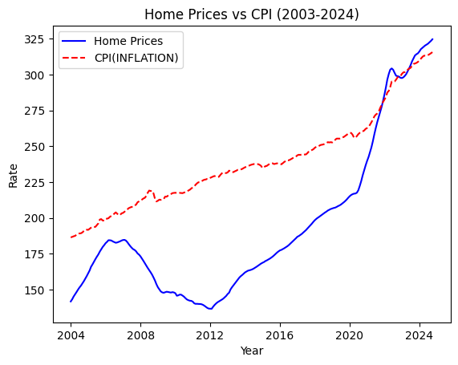
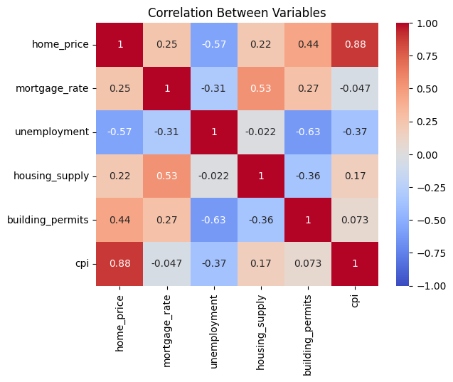
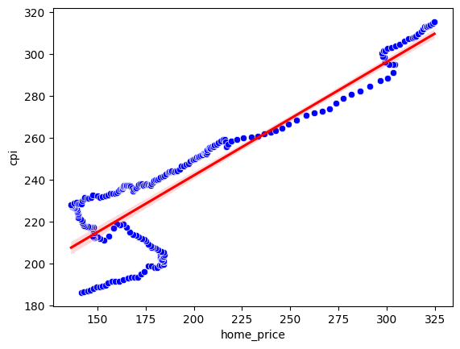
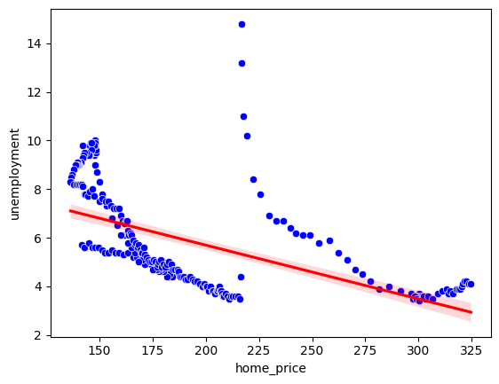
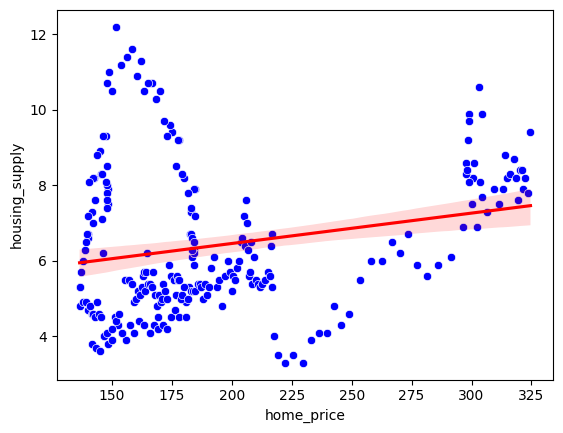

# US Home Price Analysis (2003–2024)

This project analyzes the factors influencing US home prices over the last 20 years using publicly available data. The analysis includes data cleaning, exploratory data analysis (EDA), and a linear regression model to identify key drivers of home prices.

---

## **Project Overview**
- **Objective**: Identify and quantify the impact of key macroeconomic factors on US home prices.
- **Dependent Variable**: S&P Case-Shiller Home Price Index (`CSUSHPISA`).
- **Independent Variables**:
  - 30-Year Fixed Mortgage Rate (`MORTGAGE30US`)
  - Unemployment Rate (`UNRATE`)
  - Housing Supply (`MSACSR`)
  - Building Permits (`PERMIT`)
  - Consumer Price Index (`CPIAUCSL`)

---

---

## **Key Findings**
1. **CPI (Inflation)**:
   - Strongest positive correlation with home prices (`0.88`).
   - Rising inflation leads to higher home prices.
2. **Unemployment**:
   - Strongest negative correlation with home prices (`-0.57`).
   - Higher unemployment reduces home prices.
3. **Mortgage Rates**:
   - Moderate positive correlation (`0.25`).
   - This suggests that as mortgage rates increase, home prices also tend to rise, potentially reflecting common economic factors such as inflation.

4. **Housing Supply**:
   - Weak positive correlation (`0.22`).
   - This indicates that an increase in housing supply is slightly associated with higher home prices, although the relationship is not very strong.

5. **Building Permits**:
   - Moderate positive correlation (`0.44`).
   - This suggests that higher numbers of building permits, which signal increased construction activity, are associated with higher home prices.

---

## **Visualizations**
### 1. Home Prices vs CPI (2003–2024)

### 2. Correlation Heatmap

### 3. Scatter Plots
- **Home Prices vs CPI (Inflation)**:
  
- **Home Prices vs Unemployment**:
  
- **Home Prices vs Housing Supply**:
  

---

